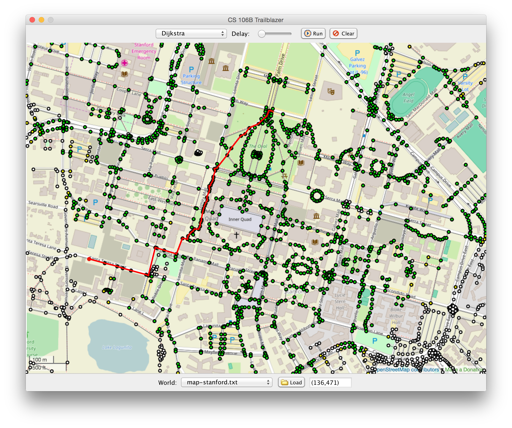

# Heap

Heaps are rooted graphs that have a wide range of applications, mainly for quick ranking of an unordered set of elements or nodes. It consists of nodes and edges, with a parent node unidirectionally connected from itself to its children nodes. All children nodes satisfies an inequality invariant with respect to its parent.

There are variants of heaps such as Fibonacci Heap, Binomial Heap and Brodal Queue. Some heap structures are theoretically more efficient but exists only in literature, others perform better in specific algorithms.

The walkthrough example below will demonstrate some of the common operations.

## References

[Youtube - Abdul Bari](https://www.youtube.com/watch?v=HqPJF2L5h9U&t=1722s)\
[MIT OCW](https://www.youtube.com/watch?v=B7hVxCmfPtM&t=1382s)\
[Stackoverflow](https://stackoverflow.com/questions/9755721/how-can-building-a-heap-be-on-time-complexity)


## Example - Max Binary-Heap

Heap H is an integer-type max binary-heap, which has the invariant property of children nodes must be greater than [or equal to] its parent. The root node is the highest priority node in the tree.
```
    Heap H
                                             Value                                                Index

Level 0 (Root)                                10                                                    0
                                            /    \                                                /    \
Level 1                                    7      4                                              1      2
                                         /  \    /  \                                          /  \    /  \
Level 2                                 2    5  1    3                                        3    4  5    6
                                                                                            /   \
                                                                                           7    ................
```
### Positions

Node index notation starts from the root. A child node can derive the index of the parent and vice versa. The notation is useful for index-based traversal and access when implementing a heap structure in code.

`idx_p = (idx_c) => floor((idx_c - 1) / 2)`

`idx_child_left = (idx_p) => idx_p * 2 + 1`

`idx_child_right = (idx_p) => idx_p * 2 + 2`


### Ordering

Ordering / transitive relation is preserved top-down.

i.e left-most branch of Heap H: 10 > 7 > 2

### Height

Height of the tree is similar to a tree in the order of `O(log_n k)` where `n` is maximum no. of children and `k` is no. of nodes.

### Operations

#### Node Insertion (bubble-up)

A new node should alter the tree without violation of heap invariant.

Consider the operation `Insert([9])` - insertion of a new node with value 9 at index 7 in Heap H. 

1. The new node is placed from the left-most position in the lowest incomplete level and a edge is formed from the parent (see [positions](#Positions)). The altered branch from root would be 10 -> 7 -> 2 -> [9] with heap invariant violated, i.e 10 > 7 > 2 !> [9]. At this point, the new node may violate the heap structure. 

```
    Heap H'                               Insert([9])

                                        Initial Placement

Level 0 (Root)                                10                                                   
                                            /    \                                              
Level 1                                    7      4                                            
                                         /  \    /  \            (Bad)                       
Level 2                                 2    5  1    3
                                       /
[Level 3]                            [9]
```

2. To reinstate a good heap, a "bubble-up" operation is performed on the new node. The new node successively swaps with its parent if heap invariant does not hold and promotes until relation with a parent satifies the heap invariant. 

Each swap also preserves the heap invariant in diverging branches, since the new node (new parent) would satisfy the same inequality as the old parent (in respect to its children). i.e after 1st bubble up, 10 > [9] > 5.

```
    Heap H' (left-most branch)                                      Insert([9]) - Bubble Up

                                         2 !> 9                        7 !> 9                    10 > 9  

Level 0 (Root)                               10                          10                        10                             
                                            /             bubble-up     /          bubble-up      /
Level 1                                    7   ...           =>        7   ...        =>         [9]  ...               (OK)       
                                         /   \                        /  \                      /   \
Level 2                                 2      5                    [9]   5                    7     5
                                       /                            /                         /
[Level 3]                            [9]                           2                         2
```

The insertion operation is bounded by the number of comparisons/swaps during the walk of the new node; in the order of `O(log_n k) = O(height)`. 

#### Deletion of the Root (bubble-down)

Consider the operation Delete() - removing the root.

1. The root node is extracted and replaced by the right-most leaf node in the lowest level (last index in the heap).

2. A bubble-down operation is performed. Let the new root be the target node. The bubble-down operation successively swaps with the highest priority child, if the latter has a higher priority than the target node.

```
    Heap H'' (left-most branch)                                        Delete([9])

                                                                      9 > 2 && 9 > 4              7 > 2 && 7 > 5
 
Level 0 (Root)                               [ ]                            [2]                          9                        9 
                         Extract            /    \         Replace         /   \     bubble-down       /   \      bubble-down   /   \
Level 1                    =>              9      4         =>            9     4       =>           [2]    4 .     =>         7     4       (OK)
                                         /   \   / \                     /  \  / \                  /   \  /  \               / \   / \
Level 2                                 7     5...                      7    5...                  7     5...               [2]  5...
                                       /                           
[Level 3]                             2                                                 
```

The deletion operation is bounded by the number of comparisons/swaps during the walk of the new node; in the order of `O(log_n k) = O(height)`. 

#### Building a Heap (Heapify)

Consider a set of elements S = { 1, 2, 3 }.

Heapify is the process of building a heap from a set of elements using an array. Starting with an empty array, there are two approaches to heapify:

1. Using bubble-up: From an empty heap, elements are inserted using Insert() operation - nodes are filled from the top. Time complexity is in `O(k) * O(log k) = O(k log k)`.


```
        1                         2                           3  
              Insert            /           Insert          /   \
                =>            1               =>          1       2      .....
```


2. Using bubble-down: If the size of the set k is known and an array of size k is initialized, this approach is more efficient. The heap will be constructed from the leaf level (last index k-1 til index 0). 

```

        [ ]                    [ ]                 [3]
       /   \         =>       /   \        =>     /   \
    [ ]     [1]             [2]   [1]           [2]   [1]

```

A [careful analysis](https://stackoverflow.com/questions/34329942/siftup-and-siftdown-operation-in-heap-for-heapifying-an-array) will show that the complexity is much faster than approach 1:

```
T(k) = O( k/2 * 1 + k/4 * 2 + k/8 * 3 + k/16 * 4 + ... + k / k * 1) // Final cost is inserting root
     = O(k)
```

### Applications of the Heap Data Structure

The heap is useful where frequent operations are insertion, and deletion or access of the highest priority node. Min-heap is part of Dikjstra's algorithm which attempts to find shortest path between a pair of nodes in a [graph](https://en.wikipedia.org/wiki/Graph_theory). The min-heap, also called as a priority queue, keeps track of possible shortest-path nodes to visit. More information can be found [here](https://en.wikipedia.org/wiki/Dijkstra%27s_algorithm).


By modelling rendezvous points along roads as nodes and function of time/distance between points as weighted edges, Dikjstra's algorithm is useful for foodpanda riders to navigate locations in the proximity faster and increase delivery throughput.


Credits: http://web.stanford.edu/class/archive/cs/cs106b/cs106b.1176//assn/trailblazer.html